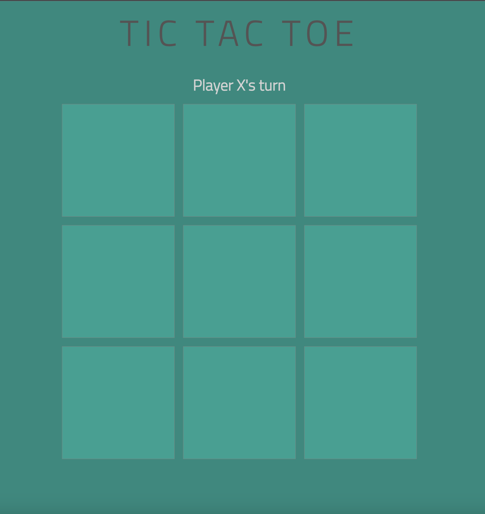
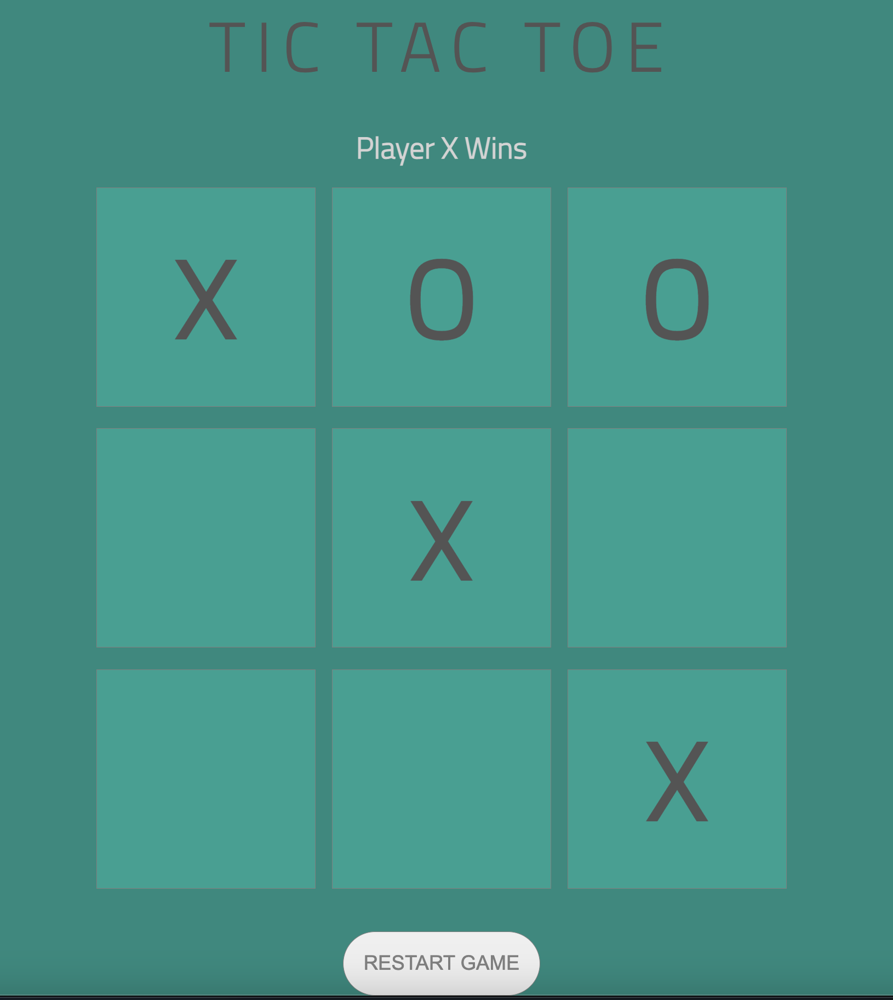
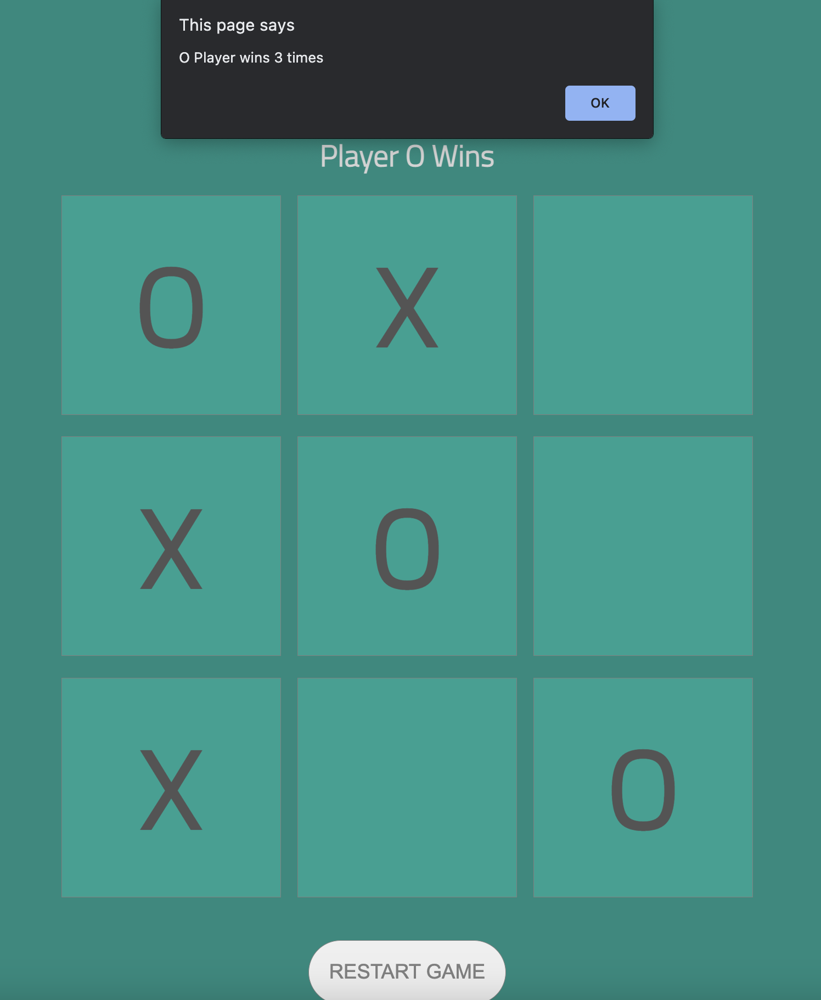
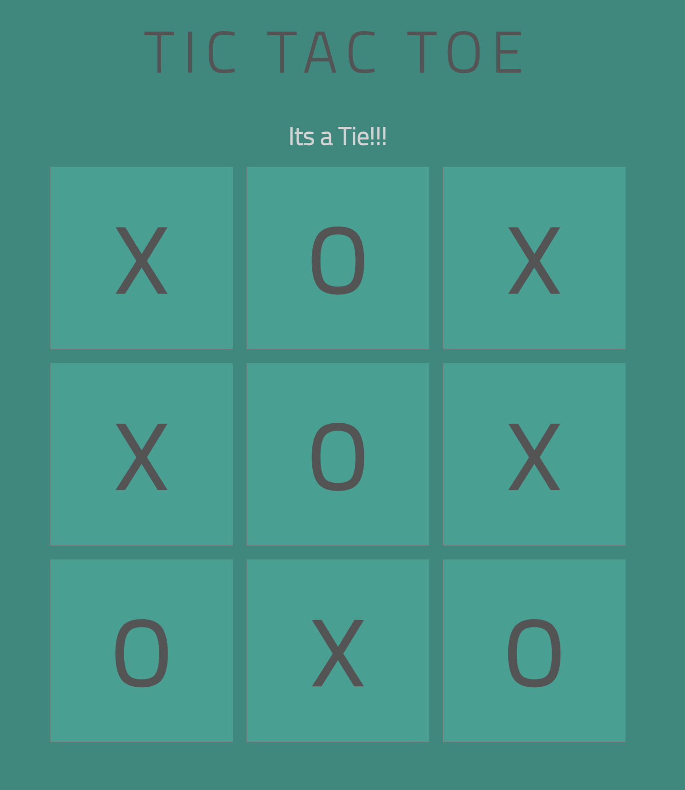

## TIC TAC TOE 
#### ....by Sapana Palkhade
---
### Project's Screenshot : 

 

---

### Technologies Used: JavaScript, HTML, CSS
---

### Application code URLs  

#### [GitHub Repo Link](https://github.com/SapnaPalkhade/unit-1-project)
#### [Live Project Link](https://tictactoe--sapnapalkhade.repl.co)
---
### Game instructions:

### This game is played on a three-by-three-square grid. You are X, and your friend is O. Each player takes turns placing their mark in an empty square. 
### The winner is the first player to get three of her markers in a row (up, down, across, or diagonally).
---

### Next Steps: It would be good to enhance this game so that you can play against the computer as a second player.

### Pseudocode
// global variables (access throughout the scope)

Set ‘white’ to 0
Set ‘X player’ to 1
Set ‘O player’ to -1

// state variables (for board)

Set ‘turn’ to each player(1 or -1)
Set ‘board’ ( 3 x 3 grid)
Set ‘winner’

[function]

         Set turn’ to 1

         Set ‘board’ to []

         Set ‘winner’ to  null

[render()] to display DOM elements

[function]

  If ‘index’ is continuous at vertically.horizontally or diagonally marked by same player

[return] ‘winner’

else ‘Tie’ 

else ‘board is full’

Set ‘turn’

[render()]

[function] 

      [return]  to get the ’winner’

[function]

       [return] ‘sequence of index’……vertical

[function]

       [return] ‘sequence of index’……horizontal 

[function]

       [return] ‘sequence of index’……diagonal

[function]

           [for rendering DOM]

            [ for board]

             [for messages]

             [to control]